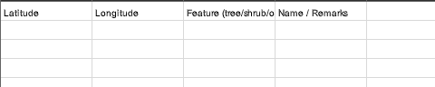
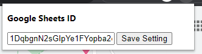
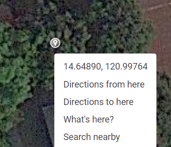
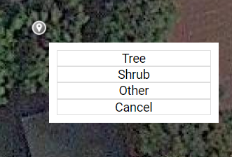
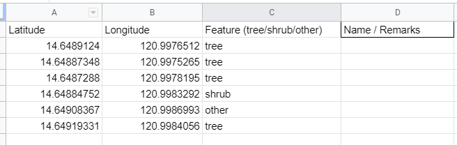

# CWTS Pins

> Extension for saving Google Maps Coordinates to Google Sheets.

1. Save coordinates in two clicks.
2. Supports feature identification ( `tree`, `shrub`, `others` )

### Why?

I'm lazy.

### Getting Started

1. Create Spreadsheet

   - **IMPORTANT:** Add header rows (`Latitude`,`Longitude`,etc.)
   
     

   - Share the sheet to the extension server's email (`hatchling@evident-wind-286216.iam.gserviceaccount.com`)
   - Copy the sheet ID (in the URL)
     `https://docs.google.com/spreadsheets/d/{SHEET_ID_HERE}/edit#gid=0`

2. Install Extension

   > Yeah, I won't publish this to the web store. Too much hassle.

   - Clone or download this repo. (Advisable na i-clone, para EZ mag pull ng updates.)
   - Go to `chrome://extensions`
   - Enable **Developer Mode**
   - Click **LOAD UNPACKED** and select the extension directory
   - Done!

3. Try

   - Go to `https://google.com/maps`
   - Click the extension icon
   - Enter your sheet ID and press **Save Setting**
 
     

   - Pick a location. Right click and click the coordinates.
 
      
   - Choose feature
     
      
   - Tada!
     
      
